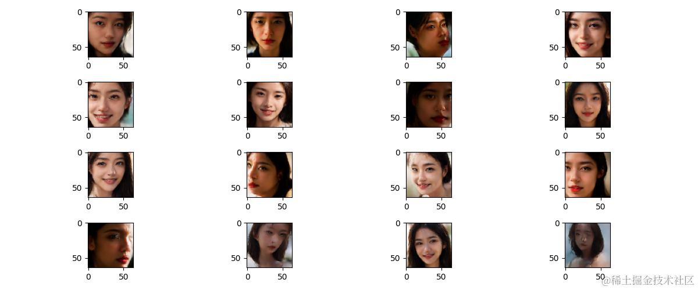

# 背景目标
---------------
平时都是在用 AI 工具生成美女写真，审美已经麻木疲劳了，翻来覆去就那么几样，所以我想下定决心自己亲手实现一次模型训练和生成过程，这样一旦我把整个工程的流程走通，我就可以按照自己的兴趣爱好，搜集相应的图片生成自己想要的内容了（嘻嘻懂得评论区打 666 ），所以才有了本文的内容。目标就是：

- 实现扩散模型，并生成美女写真图片

# 前期准备
---------------
- stable diffusion webui
- tensorflow-gpu 2.10
- anaconda 虚拟环境
- python 3.10
- 显卡 4090

# 数据生成
-----------------
我手头没有那么多美女图片，怎么办呢？灵机一动，我有 `stable diffusion` ，可以生成一波。于是进行了一次烧卡行动，选择`麦橘写实`基础模型，然后填入常见的正向和负面提示词，主要就是`“一个美丽的女孩”、“面部特写”、“看着观众”、“微笑”`等提示词，每次生成 100 张图片，生成了 10 次，剔除了了吓人的鬼图，剩下了 `972 `张图片，效果如下，都是美女的写真。用 `stable diffusion` 生成的美女图来当作我的扩散模型的训练数据，然后用扩散模型再去生成美女图片，这是不是就是`武当梯云纵，左脚踩右脚`吗？我他娘的真是个天才。


<div align=center>
    

    
</div>

# 理论基础

---


整个论文中对于模型的数学推导很复杂，涉及到很多高数的内容，但是最后繁重求简之后，得到的结论却是非常简单的，我们可以直接使用结论来复现模型的结构。要实现扩散模型生成数据需要两步：

1. 训练阶段：使用定义好的`超参数`在`不同时间步`对`原图`进行添加`不同程度的噪声`，这些噪声作为我们的`标签`，然后使用`扩散模型`生成`预测噪声`，计算`预测噪声`和`原噪声`的损失值，最后计算梯度`更新扩散模型`，不断重复这个过程直到收敛。

3. 采样阶段：模型训练好，从一个正态分布的`全噪声图`中，不断使用`扩散模型去噪`，逐渐`生成原图`。

# 扩散模型
---
扩散模型主要使用的是 `Unet` 的网络结构框架，U-Net 的最初是应用在`医学图像分割`，但是扩散模型在此基础上进行了些变化，主要有 `6` 个部分：


1.  **编码器（Encoder）部分**：U-Net 的编码器部分由多个`卷积层`组成，用于从输入图像中提取特征信息。这些卷积层通常包括`卷积操作`、`激活函数`和`池化层`。编码器的任务是逐渐降低图像分辨率，同时提取高级语义特征。
1.  **中间连接（Bottleneck）** ：U-Net 的中间连接部分将编码器的输出连接到解码器的输入。这个连接允许网络在不同分辨率上`融合低级和高级特征信息`，以便更好地还原细节。
1.  **解码器（Decoder）部分**：解码器部分由多个`卷积层`和`上采样`操作组成，用于逐步`恢复图像`的分辨率，并生成预测噪声结果。
1.  **跳跃连接（Skip Connections）** ：U-Net 的关键设计特点是跳跃连接，它将`编码器的特征图与解码器的特征图相连接`。这些跳跃连接有助于传递详细的局部信息，帮助网络准确地预测噪声。
1.  **残差连接（Residual Connections）** ：残差连接是一种用于解决深度神经网络训练中的`梯度消失和梯度爆炸`问题的技术。在 U-Net 的解码器、中间连接、解码器中引入残差连接，可以帮助网络更`轻松地训练更深层次的模型`。残差连接通过将某一层的输入直接添加到该层的输出中。这有助于网络在反向传播中更好地传递梯度，从而加速收敛并提高模型性能。
1.  **注意力机制（Attention Mechanisms）** ：注意力机制允许神经网络在处理图像时更加关注感兴趣的区域或特征。在 U-Net 的解码器、中间连接、解码器中应用注意力机制，可以`提高网络在噪声预测的效果`。


# 模型训练
---
我们的损失函数使用均方误差  ```MeanSquaredError``` ，优化器为 ```Adam```，进行 800 个 epoch 的训练，每个 epoch 耗时平均 5 秒。

    Epoch 1/800
    15/15 [==============================] - 19s 356ms/step - loss: 0.9907
    Epoch 2/800
    15/15 [==============================] - 5s 357ms/step - loss: 0.9657
    ...
    Epoch 718/800
    15/15 [==============================] - 6s 363ms/step - loss: 0.0163
    Epoch 719/800
    15/15 [==============================] - 6s 364ms/step - loss: 0.0198
    ...
    Epoch 799/800
    15/15 [==============================] - 6s 359ms/step - loss: 0.0233
    Epoch 800/800
    15/15 [==============================] - 6s 360ms/step - loss: 0.0174


# 效果展示
---
下图就是使用训练好的模型进行图像的绘制，可以看出来大部分还是比较不错的。从整个模型的训练和测试过程中有可以得出以下结论：

- 优点：生成效果比较好，灵活的模型架构、不需要对抗训练
- 缺点：计算复杂度较高，生成速度慢 

 
# 后文
---
如果大家有什么有趣的想法也可以评论区留言，欢迎讨论。

# 参考
---
- https://arxiv.org/abs/2006.11239
- https://www.bilibili.com/video/BV1Re4y1s7uV?p=1&vd_source=66ea1dd09047312f5bc02b99f5652ac6
- https://github.com/AUTOMATIC1111/stable-diffusion-webui
- https://github.com/wangdayaya/DP_2023/blob/main/NLP%20%E6%96%87%E7%AB%A0/Denoising%20Diffusion%20Probabilistic%20Model.py
